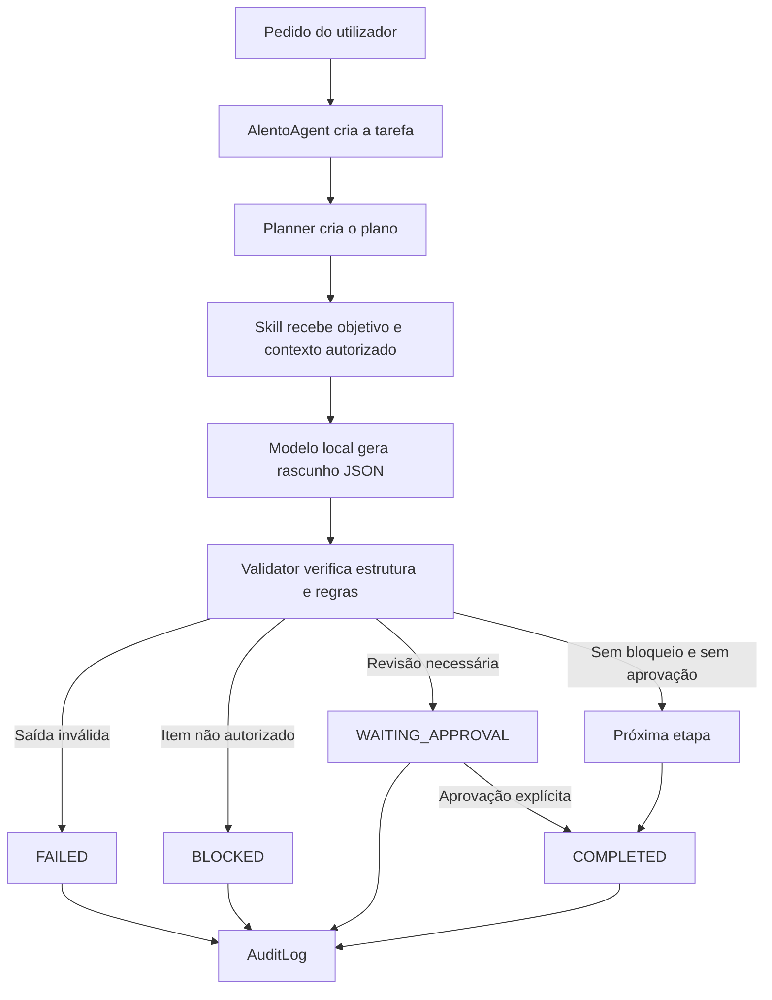

# AlentoSoft-IA — Arquitetura de controlo, validação e aprovação

**Documento:** Arquitetura e fluxo do agente  
**Versão:** 0.1 — protótipo  
**Estado:** Documento técnico de desenvolvimento  
**Projeto:** AlentoSoft-IA  
**Escopo:** Orquestrador local para tarefas administrativas, com preparação para domínios clínicos e sensíveis

> **Este documento descreve o protótipo de desenvolvimento. O AlentoSoft-IA ainda não está autorizado para prescrição, diagnóstico, evolução clínica oficial, gravação de consultas, alteração de prontuário ou qualquer decisão clínica em ambiente real.**

## 1. Objetivo

O AlentoSoft-IA não deve ser entendido como um modelo de linguagem isolado. O seu objetivo é funcionar como uma camada de orquestração entre o utilizador, o modelo local, as fontes autorizadas, as ferramentas disponíveis, as políticas de segurança e a aprovação humana.

A regra central da arquitetura é:

> **O modelo propõe; o orquestrador controla; as políticas autorizam; o validador verifica; o humano aprova; a auditoria regista.**

Essa separação é necessária porque uma resposta pode estar correta do ponto de vista sintático e ainda assim conter informação inventada, uma ação não autorizada ou um item que deveria ser bloqueado. Por isso, o resultado produzido pelo Qwen não é publicado diretamente.

## 2. Princípios de segurança

| Princípio | Aplicação no sistema |
|---|---|
| Separação entre modelo e controle | O Qwen gera uma proposta; o `AlentoAgent` decide se ela pode avançar. |
| Negação por padrão | Ferramentas e ações não autorizadas são recusadas. |
| Fonte autorizada | A skill fundamentada recebe um documento específico e deve citar seção e evidência. |
| Validação independente | O `Validator` verifica a saída fora do modelo. |
| Aprovação humana | Rascunhos que exigem revisão ficam pendentes até uma aprovação explícita. |
| Bloqueio de conteúdo não autorizado | Qualquer item com `status: blocked` interrompe a tarefa. |
| Isolamento de workspace | O agente só pode ler e escrever dentro da pasta da tarefa. |
| Separação de memória | A memória deve ser organizada por domínio, sem memória clínica global. |
| Auditoria | Eventos importantes são registrados no `AuditLog`. |
| Evolução incremental | O sistema começa com tarefas fictícias e não clínicas antes de receber dados reais. |

## 3. Componentes e responsabilidades

A tabela seguinte identifica onde cada controle é implementado no código.

| Componente | Localização | Responsabilidade |
|---|---|---|
| `AlentoAgent` | [`alento_soft_ia/core.py`](../../alento_soft_ia/core.py) | Coordena criação, execução, validação, aprovação, bloqueio e conclusão das tarefas. |
| `Planner` | [`alento_soft_ia/core.py`](../../alento_soft_ia/core.py) | Cria a sequência explícita de etapas da tarefa. |
| `Validator` | [`alento_soft_ia/core.py`](../../alento_soft_ia/core.py) | Verifica estrutura, campos obrigatórios, fontes, evidências, estados e itens bloqueados. |
| `TaskStatus` e `Step` | [`alento_soft_ia/core.py`](../../alento_soft_ia/core.py) | Representam os estados da tarefa e de cada etapa. |
| Políticas por domínio | [`alento_soft_ia/policy.py`](../../alento_soft_ia/policy.py) | Define ferramentas permitidas, necessidade de aprovação e possibilidade de escrita externa. |
| Registro de ferramentas | [`alento_soft_ia/tools.py`](../../alento_soft_ia/tools.py) | Expõe somente ferramentas registadas e verifica permissões antes da execução. |
| Workspace | [`alento_soft_ia/workspace.py`](../../alento_soft_ia/workspace.py) | Impede acesso a caminhos fora da pasta autorizada. |
| Memória por domínio | [`alento_soft_ia/memory.py`](../../alento_soft_ia/memory.py) | Mantém memória separada e bloqueia memória clínica global no MVP. |
| Auditoria | [`alento_soft_ia/audit.py`](../../alento_soft_ia/audit.py) | Guarda eventos de criação, execução, falha, aprovação, bloqueio e conclusão. |
| Skill fundamentada | [`alento_soft_ia/llm_skill.py`](../../alento_soft_ia/llm_skill.py) | Envia ao modelo a fonte autorizada e exige saída estruturada com evidência. |
| Adaptador Ollama | [`alento_soft_ia/provider.py`](../../alento_soft_ia/provider.py) | Liga o orquestrador ao endpoint local do Ollama com JSON Schema e `think=false`. |
| CLI | [`alento_soft_ia/main.py`](../../alento_soft_ia/main.py) | Executa tarefas e expõe o resultado, estado, validação, provider e latência. |

## 4. Fluxo geral de uma tarefa

O fluxo atual é deliberadamente explícito:



A sequência não é apenas uma recomendação no prompt. Ela está representada no objeto `Task`, nos objetos `Step` e no método `AlentoAgent.run`. O modelo não tem permissão para declarar que uma tarefa está concluída sem que o código percorra as etapas e aceite o resultado.

## 5. Plano padrão da tarefa

O `Planner` cria cinco etapas no protótipo:

| Ordem | Identificador | Finalidade | Resultado possível |
|---:|---|---|---|
| 1 | `understand` | Clarificar objetivo e domínio | Etapa concluída |
| 2 | `gather` | Reunir dados autorizados | Etapa concluída |
| 3 | `draft` | Produzir rascunho estruturado | Resultado do modelo ou da skill |
| 4 | `validate` | Validar formato, permissões e riscos | Concluída, falha ou bloqueio |
| 5 | `approve` | Aguardar autorização humana quando necessário | Concluída ou pendente |

O resultado final só deve ser tratado como concluído depois de passar pela validação e, quando exigido, pela aprovação. A geração do texto é apenas uma etapa intermediária.

## 6. O modelo é um gerador de proposta

O adaptador do Ollama envia ao modelo local uma solicitação estruturada com:

- `think=false` por padrão para tarefas simples;
- `temperature=0` para reduzir variação durante os testes;
- `format` com JSON Schema;
- `keep_alive` para evitar recarregamento desnecessário durante testes consecutivos;
- objetivo, domínio e fonte autorizada, quando a skill é fundamentada.

A skill fundamentada adiciona regras importantes ao contexto do modelo: usar exclusivamente a fonte fornecida, não inventar fatos, informar o que não estiver na fonte, citar seção e evidência e manter a natureza fictícia do documento.

Essas instruções melhoram o comportamento do modelo, mas **não são o controle final**. A decisão de aceitar, bloquear ou aguardar aprovação é feita pelo código do orquestrador.

## 7. Validação estrutural e semântica

A validação possui duas dimensões diferentes.

### 7.1 Validação estrutural

A validação estrutural verifica se a resposta tem o formato exigido. No contrato atual, a saída precisa conter `summary`, `items`, `sources`, `missing_information`, `human_review_required` e `status`.

Cada item precisa conter:

| Campo | Finalidade |
|---|---|
| `id` | Identificador numérico do item. |
| `description` | Descrição da ação ou pendência. |
| `responsible` | Responsável informado pela fonte ou `Não informado`. |
| `status` | `pending`, `done` ou `blocked`. |
| `source_section` | Seção da fonte que fundamenta o item. |
| `evidence` | Evidência textual curta que sustenta o item. |

JSON válido não significa que a resposta seja confiável. Uma resposta pode obedecer ao formato e ainda conter informação indevida.

### 7.2 Validação semântica mínima

No MVP, a principal regra semântica é a regra de bloqueio. Se qualquer item vier com `status: blocked`, a tarefa não pode ser concluída.

A validação também exige que tarefas sensíveis mantenham `human_review_required: true`. O sistema ainda precisa evoluir para comparar automaticamente a evidência do item com o texto da fonte, mas essa comparação deve ser adicionada com cautela e sempre permanecer sujeita à revisão humana.

## 8. Estados da tarefa

| Estado | Significado | Pode ser publicado? |
|---|---|---|
| `planned` | A tarefa foi criada e recebeu um plano. | Não. |
| `running` | O agente está a executar etapas. | Não. |
| `waiting_approval` | O rascunho passou pelas verificações aplicáveis, mas aguarda aprovação humana. | Não. |
| `blocked` | A saída contém item não autorizado ou bloqueado. | Não. |
| `failed` | Ocorreu erro estrutural, de execução ou de validação. | Não. |
| `completed` | Todas as etapas necessárias foram concluídas e as aprovações exigidas foram obtidas. | Apenas como resultado aprovado do fluxo. |
| `rejected` | Estado reservado para rejeição explícita numa evolução futura. | Não. |

A diferença entre `blocked` e `waiting_approval` é essencial. `waiting_approval` significa que existe um rascunho que pode ser analisado por uma pessoa autorizada. `blocked` significa que o sistema encontrou uma condição que impede o avanço; a aprovação comum não deve transformar automaticamente esse conteúdo em resultado oficial.

## 9. Exemplo real do teste com a política fictícia

No teste da política `FIC-RH-001`, o pedido solicitava antecedentes criminais, exame médico e referências pessoais, enquanto a fonte fictícia dizia que esses itens não eram solicitados.

O Qwen identificou os itens como `blocked`. Antes da correção do orquestrador, a tarefa ainda aparecia como `completed`, porque o JSON era estruturalmente válido. Essa era uma falha de controle: o sistema confundia formato correto com autorização.

Depois da correção, o percurso passou a ser:

```text
Qwen gera JSON válido
        ↓
Validator verifica campos e estados
        ↓
Validator encontra item com status = blocked
        ↓
AlentoAgent altera a tarefa para BLOCKED
        ↓
A etapa de aprovação não é executada
        ↓
output não é publicado como resultado final
        ↓
AuditLog registra task_blocked
```

Esse teste demonstrou o princípio fundamental da arquitetura: **o modelo pode sugerir; somente o orquestrador pode avançar a tarefa**.

## 10. Políticas e permissões

O arquivo `policy.py` organiza regras por domínio. Os domínios atuais são `general`, `engineering`, `clinical`, `hr` e `finance`.

No protótipo, os domínios sensíveis exigem aprovação humana e não podem escrever em sistemas externos. O `ToolRegistry` consulta a política antes de executar uma ferramenta. Uma ferramenta desconhecida ou não autorizada gera erro de permissão.

No futuro, a política deverá deixar de depender apenas do nome do domínio e passar a considerar:

| Dimensão | Exemplo de decisão |
|---|---|
| Utilizador | Quem está a fazer o pedido? |
| Função | Médico, RH, financeiro, administrador ou programador? |
| Unidade | A qual unidade ou setor pertence? |
| Recurso | Qual paciente, documento ou processo está a ser consultado? |
| Ação | Ler, gerar rascunho, alterar, aprovar ou publicar? |
| Sensibilidade | A informação contém dados clínicos, pessoais, financeiros ou trabalhistas? |

Um profissional de marketing não deve receber acesso a uma ferramenta de prontuário apenas porque o modelo conhece a ferramenta. O acesso deve ser negado na camada de política e ferramenta.

## 11. Workspace isolado

O `Workspace` resolve todos os caminhos relativos dentro de uma raiz autorizada. Se um pedido tentar alcançar um caminho como `../../prontuario_real.db`, o sistema verifica que o caminho resolvido está fora da raiz e lança uma `PermissionError`.

Esse controle é independente do modelo. Mesmo que o modelo gere um caminho indevido, a camada de filesystem deve impedir a leitura ou escrita fora do workspace da tarefa.

O MVP não deve receber acesso direto ao shell, ao sistema de prontuário, à rede hospitalar ou a bases reais. Ferramentas externas só devem ser introduzidas depois de haver autenticação, autorização, logs, testes e aprovação institucional.

## 12. Memória por domínio

A memória do agente não deve ser uma memória global contendo informações de todas as áreas. O desenho atual separa a memória por domínio e bloqueia a criação de chaves `global:` na memória clínica.

A evolução necessária é associar cada entrada a utilizador, função, unidade, finalidade, período de retenção e nível de sensibilidade. Memória clínica, memória de RH e memória financeira não devem ser misturadas.

## 13. Auditoria

O `AuditLog` utiliza SQLite no protótipo e registra eventos como:

```text
task_created
task_started
approval_required
task_blocked
task_failed
task_completed
```

A auditoria não substitui o prontuário nem deve ser usada como único mecanismo de conformidade. Para um ambiente hospitalar, o registro deverá evoluir para incluir identificador do utilizador, perfil, timestamp confiável, modelo e versão utilizados, fonte consultada, versão do prompt, decisão do validador, alterações humanas e identidade do aprovador.

A auditoria também precisa ter política de retenção, proteção contra alteração indevida, cópias de segurança e acesso restrito.

## 14. O que já está protegido no MVP

O protótipo atual já demonstra os seguintes controles:

| Controle | Situação |
|---|---|
| Plano explícito de tarefas | Implementado |
| Saída JSON estruturada | Implementado |
| Validação independente do modelo | Implementado |
| Fonte autorizada para skill fundamentada | Implementado |
| Seção e evidência por item | Exigidas pelo schema |
| Bloqueio de itens não autorizados | Implementado |
| Aprovação humana para drafts | Implementado |
| Permissões por domínio | Implementado em nível inicial |
| Registry de ferramentas | Implementado sem shell arbitrário |
| Workspace isolado | Implementado |
| Memória por domínio | Implementada em nível inicial |
| Auditoria | Implementada em SQLite |
| Autenticação e RBAC real | Ainda não implementado |
| Integração com prontuário | Ainda não implementada |
| Áudio e transcrição clínica | Ainda não implementados |

## 15. Limites atuais

O AlentoSoft-IA não deve ser usado neste estado para tomar decisões clínicas, prescrever medicamentos, diagnosticar, assinar evoluções, publicar dados no prontuário, processar áudio de pacientes ou operar sobre dados reais de saúde.

O protótipo ainda não possui uma interface Web multiutilizador, autenticação integrada, RBAC completo, gestão formal de consentimento, criptografia de dados em repouso, gestão de chaves, retenção institucional, monitorização de produção ou integração certificada com sistemas hospitalares.

A validação do modelo também não elimina alucinações. O sistema reduz o risco ao limitar fontes, exigir evidências, bloquear itens e requerer revisão, mas não transforma automaticamente uma resposta de IA em informação verdadeira ou em decisão profissional.

## 16. Próximas etapas recomendadas

A sequência de evolução deve ser:

1. Implementar autenticação e RBAC por função, domínio e recurso.
2. Criar uma interface de aprovação que mostre o pedido, a fonte, o rascunho, as evidências, os bloqueios e as alterações.
3. Adicionar comparação entre resposta e fonte, com destaque para afirmações sem evidência.
4. Criar ferramentas administrativas reais, ainda sem dados clínicos.
5. Adicionar filas, limites de concorrência, métricas e tratamento de falhas.
6. Criar ambiente de teste com dados sintéticos para áudio e transcrição.
7. Avaliar consentimento, retenção, acesso e auditoria antes de qualquer piloto clínico.
8. Só então estudar integração controlada com o prontuário.

> **Não se deve começar pelo áudio clínico. Deve-se começar por identidade, autorização, fontes, validação e aprovação.**

## 17. Testes relacionados

Os comportamentos de segurança estão cobertos pelos testes em [`tests/test_security.py`](../../tests/test_security.py), [`tests/test_core.py`](../../tests/test_core.py), [`tests/test_validation.py`](../../tests/test_validation.py) e [`tests/test_ollama_provider.py`](../../tests/test_ollama_provider.py).

Para executar a suíte:

```bash
cd /home/ubuntu/alento-soft-ia
PYTHONPATH=. python3 -m unittest discover -s tests -v
```

O projeto deve ser considerado pronto para a próxima etapa somente quando os testes continuarem a demonstrar que uma saída inválida falha, um item bloqueado bloqueia a tarefa e uma tarefa que requer revisão aguarda aprovação explícita.

## 18. Decisão arquitetural resumida

O AlentoSoft-IA utilizará um **orquestrador próprio**, com provider desacoplado do modelo. O Ollama é o provider de desenvolvimento atual. O Qwen3.5 é um componente substituível, não a autoridade de segurança do sistema.

A arquitetura foi desenhada para permitir futura substituição do Ollama por vLLM ou outro servidor de modelos sem reescrever o núcleo de planeamento, validação, políticas, ferramentas, memória e auditoria.
